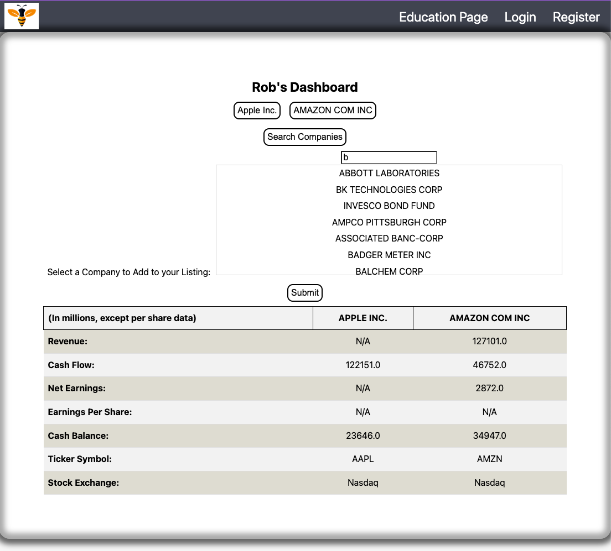
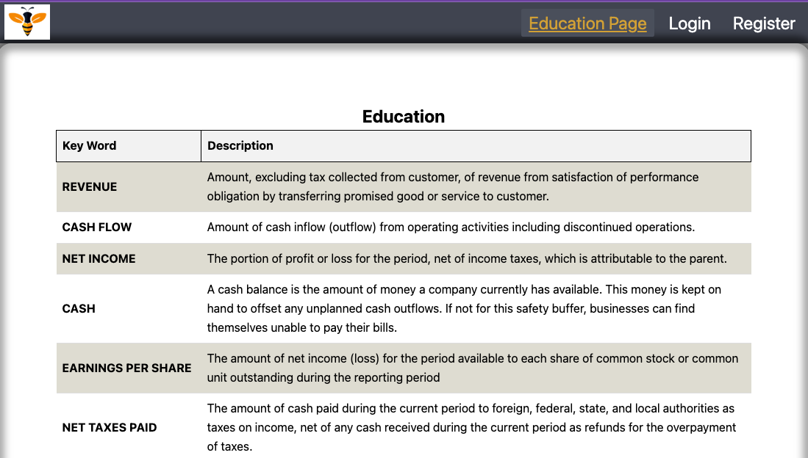

# NewBee Financial


## Description

NewBee Financial is an application that educates the beginner investor in understanding key financial metrics of major public companies in the United States.

[Link to the live app](https://infinite-wildwood-67913.herokuapp.com/)


## Table of Contents


- [Technologies Used](#technologies-used)
- [Code Highlights](#code-highlight)
- [Feature Development](#feature-development)
- [Author Info](#author-info)
- [Credits](#credits)
- [License](#license)

## Technologies Used

### Front-End:

| Technology Used         | Resource URL           | 
| ------------- |:-------------:| 
| React | [https://reactjs.org/](https://reactjs.org/)     |   
| CSS | [https://developer.mozilla.org/en-US/docs/Web/CSS](https://developer.mozilla.org/en-US/docs/Web/CSS)     |     
| JavaScript   | [https://developer.mozilla.org/en-US/docs/Learn/JavaScript](https://developer.mozilla.org/en-US/docs/Learn/JavaScript)      |
| Google Fonts    |  [https://fonts.google.com/](https://fonts.google.com/)   |  
| GraphQL    |  [https://www.graphql.com/](https://www.graphql.com/)   | 
| GraphQL    |  [https://www.graphql.com/](https://www.graphql.com/)   | 
 

### Back-End:

| Technology Used         | Resource URL           | 
| ------------- |:-------------:| 
| NPMjs    |  [https://www.npmjs.com/](https://www.npmjs.com/)   |  
| Express.js  | [https://expressjs.com/](https://expressjs.com/)     |
| Node.js   |  [https://nodejs.org/en/](https://nodejs.org/en/)    |
| Apollo Graphql    |  [https://www.apollographql.com/](https://www.apollographql.com/)   |  
| MongoDB    |  [https://www.mongodb.com/](https://www.mongodb.com/)   |  
| Bcrypt    |  [https://www.npmjs.com/package/bcrypt](https://www.npmjs.com/package/bcrypt)   |  
| JWT    |  [https://www.npmjs.com/package/jsonwebtoken](https://www.npmjs.com/package/jsonwebtoken)   |  
| React-Autocomplete    |  [https://www.npmjs.com/package/react-autocomplete](https://www.npmjs.com/package/react-autocomplete)   |  
| Heroku    |  [https://www.heroku.com/](https://www.heroku.com/)   |  

## Instructions

* Click the link to the deployed site [here](https://fierce-plains-86350.herokuapp.com/).
* Click the `Register` button in the navigation bar to submit your credentials and be able to use the application.
* Once logged in, you will be taken to the main dashboard where you can search different US public companies and be able to compare their financial health.
* click on each metric to learn more about it or use the `Education` button in the navigation bar to navigate to the education page.
* Once done using the application, click the `logout` button to ensure that your data is protected.

## Code Highlights

This is a login component that renders a form with inputs for email and password, and a submit button. It uses the useState hook to manage the state of the form and whether the user is logged in. It also uses the useMutation hook from the Apollo client library to handle GraphQL mutations. When the user submits the form, the handleFormSubmit function is called, which calls the login mutation and sets the user's token in sessionStorage using the onCompleted function. If there is an error, it is displayed on the page. When the user is logged in, they are redirected to the dashboard page. The component exports itself to be used elsewhere in the application.

```js
import React, { useState } from 'react';
import { Link } from 'react-router-dom';
import { useMutation } from '@apollo/client';
import { LOGIN_USER } from '../../utils/mutations';
import Auth from '../../utils/auth';
import "./style.css"

const Login = () => {
  
  const [formState, setFormState] = useState({ email: '', password: '' });
  const [isLoggedIn, setIsLoggedIn] = useState(false);

  const [login, { loading, error }] = useMutation(LOGIN_USER, {
    onCompleted: (data) => {
      sessionStorage.setItem('token', data.login.token);
      setIsLoggedIn(true);
    },
  });

  const handleFormSubmit = async (event) => {
    event.preventDefault();
    if (error) return
    try {
      const mutationResponse = await login({
        variables: { email: formState.email, password: formState.password },
      });
      const token = mutationResponse.data.login.token;
      Auth.login(token);
    } catch (e) {
      console.log(e);
    }
    finally{
      window.location.replace('/dashboard')
    }
  };

  const handleChange = (event) => {
    const { name, value } = event.target;
    setFormState({
      ...formState,
      [name]: value,
    });
  };

  return (
    <div className="container my-1">
      <Link to="/register">← Go to Register</Link>

      <h2>Login</h2>
      <form onSubmit={handleFormSubmit}>
        <div className="flex-row space-between my-2">
          <label htmlFor="email">Email address:</label>
          <input
            placeholder="youremail@test.com"
            name="email"
            type="email"
            id="email"
            onChange={handleChange}
          />
        </div>
        <div className="flex-row space-between my-2">
          <label htmlFor="pwd">Password:</label>
          <input
            placeholder="******"
            name="password"
            type="password"
            id="pwd"
            onChange={handleChange}
          />
        </div>
        {error ? (
          <div>
            <p className="error-text">The provided credentials are incorrect</p>
          </div>
        ) : null}
        <div>
          <button type="submit">Submit</button>
        </div>
      </form>
    </div>
  );
};

export default Login;

```

This component displays financial data for a list of companies and allows the user to click on the financial metrics to navigate to another page where they can learn what that metric is/means.
```js
import React, { useState, useEffect } from "react";
import { Link } from "react-router-dom";
import { idbPromise } from "../../../utils/helper";

export default function Data(props) {
  const [companies, setCompanies] = useState([]);

  useEffect(() => {
    const fetchData = async () => {
      const idbCompanies = await idbPromise("get");
      setCompanies(idbCompanies);
    };

    fetchData();
  }, []);

  const selectedProps = [
    { label: "Revenue:", property: "revenue" },
    { label: "Cash Flow:", property: "cashFlow" },
    { label: "Net Earnings:", property: "netIncome" },
  ];

  function handleClick() {
    window.location.replace("./learn")
  }

  return (
    <table className="financial-table">
      <thead>
        <tr>
          <th>(<span>In millions</span>, <span>except per share data</span>)</th>

          {companies.map(company => (
            <th key={company.name}>{company.name}</th>
          ))}
        </tr>
      </thead>
      <tbody>
        {selectedProps.map(prop => (
          <tr key={prop.label}>
            <td onClick={handleClick}>{prop.label}</td>
            {companies.map(company => (
              <td key={company.name}>{company[prop.property] || "N/A"}</td>
            ))}
          </tr>
        ))}
      </tbody>
    </table>
  );
}
```


## Feature Development

* As a user, when I am in my dashboard I can search companies through the use of a drop down / autocomplete menu, so I can add companies to my portfolio.


* As a user, when I am in my account I can click “Education” link so I can learn about the financial metrics.



## About the Authors 

* Brad Coleman === [Email](bradcoleman60@gmail.com) | [Linkedin](https://www.linkedin.com/in/brad-coleman-109529/) | [GitHub](https://github.com/bradcoleman60?tab=repositories) |
* Troy Johnson === [Email](troynjohnson6@gmail.com) | [LinkedIn](https://www.linkedin.com/in/troy-johnson-abb5a625a/) | [Github](https://github.com/troynj) |
* Gladys Ange Isingizwe === [Email](gladyisingizwe@gmail.com) | [LinkedIn](www.linkedin.com/in/gladys-isingizwe) | [Github](https://github.com/Isglad) |
* Peter Shaughnessy === [Email](prshaughnessy@gmail.com) | [LinkedIn](https://www.linkedin.com/in/petershaughnessy) | [Github](https://github.com/prnessy23) |

## Credits

Thank you to the UC Berkeley Bootcamp teaching staff for providing the resources and help to us in completing this project.

## License

This application is using the MIT license.
